# Project 1 - Collaborations with Git
Group IV
---
Michael Cherkassky

Catie Clark

Garet Douglass

Anna Givens

John Patten

# Used Nissan Car Listings Analysis

# Objective 
Obtain dataset to 

Questions you found interesting and what motivated you to answer them
Where and how you found the data you used to answer these questions
The data exploration and cleanup process (accompanied by your Jupyter Notebook)
The analysis process (accompanied by your Jupyter Notebook)
Your conclusions, which should include a numerical summary and visualizations of that summary
The implications of your findings: what do your findings mean? 

## I. Research and Analyze Data from True Car Listing
Determine the following:
  - Vehicle availability in TN and US Market
  - Vehicles available by Model Year
  - Model Year and Mileage Impact on Price
  - Model Year and Resale Price
  - Residual Value by Model and Model Year

Our dataset was obtained on [Kaggle - Used Car Listings] (https://www.kaggle.com/jpayne/852k-used-car-listings#true_car_listings.csv). 
**Data included: year, make, model, price, VIN, city, state**

Contains the following limitations:

 - Listings that were live on September 24, 2017
 - Model Years between 1997-2017

For the purpose of this project, we limited the data to **only include Nissan** makes which reduced the 1mil rows of the original dataset to ~60k rows. Please see the end of this document for the full list of limitations. 

# Vehicle Availability in TN and Surrounding Areas + General Trends
Catie Clark

## Findings:
- Prework, group the state by region/territory names for comparative analysis 
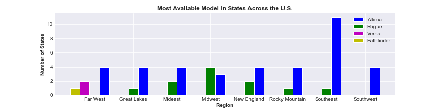

- United States: 
    - southeast/southwest: Altima most available (only 1 state did not have Altima as highest number of listings)
    - midwest (plains): there are more states with Rogue as highest number of listings than Altima as the highest
    - Alaska: only state with most Pathfinder listings
    - Nevada/Hawaii: only two states with most Versa listings
    
- Nissan: total listings **66,250**
    - when grouped by state --> 59 (prior to consolidating duplicates, VA)
    - All Models listed in Tennessee: 'Versa', 'Altima', 'Sentra', 'Rogue', 'Maxima', 'Murano','Titan', 'Quest', 'Pathfinder', 'Xterra', 'NV', 'Armada', '370Z','GT-R'
    

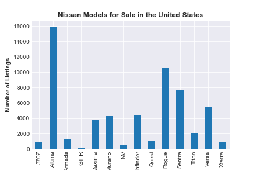

- Tennessee: 1976 listings, Altima is the most available

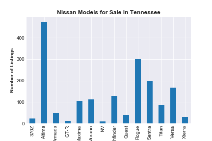

# Vehicles available by Model Year in Overall Market 
Garet Douglass

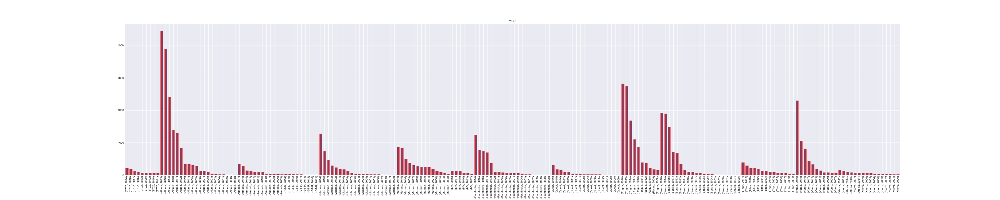
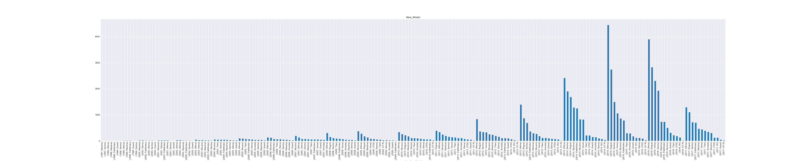
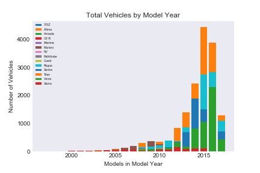
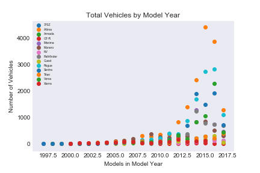

# Model Year and Mileage Impact on Price
Michael Cherkassky

## Findings:
·        Both age and mileage of a given Nissan vehicle hold only a moderate correlation to the vehicle’s price.
·        With a 50% correlation, the vehicle’s mileage only slightly edges out the vehicle’s age (47% correlation).
·        With these figures, we cannot say either mileage or age have a strong correlation to the vehicle’s listing price, so a potential buyer should not hold much weight in one category over the other.

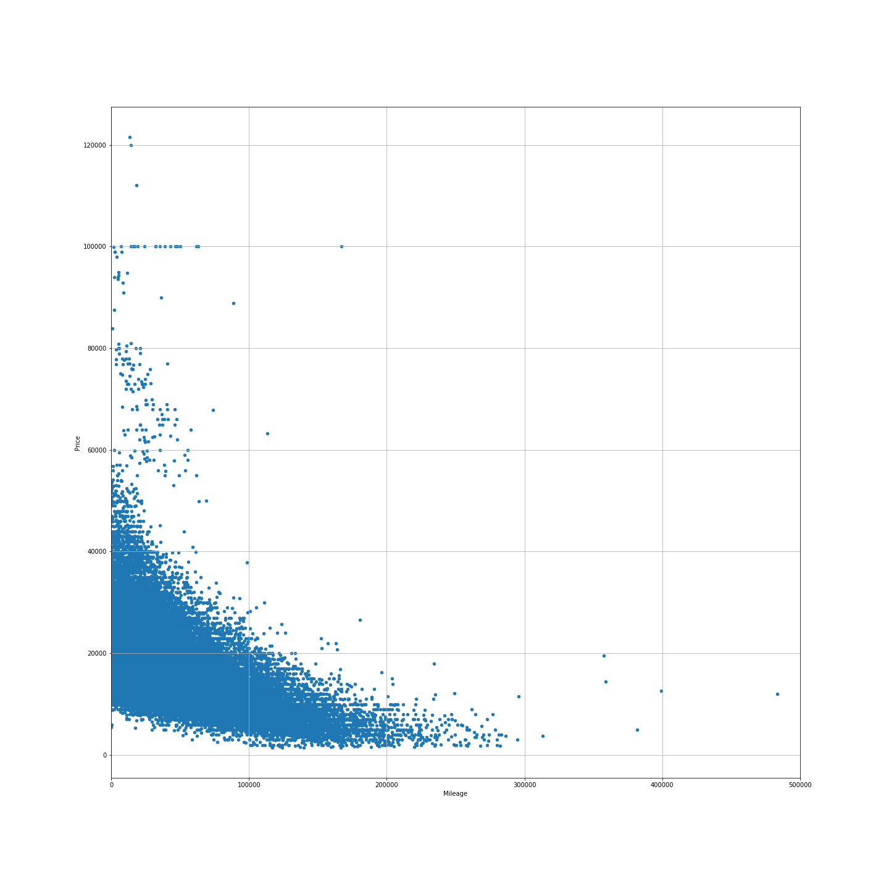
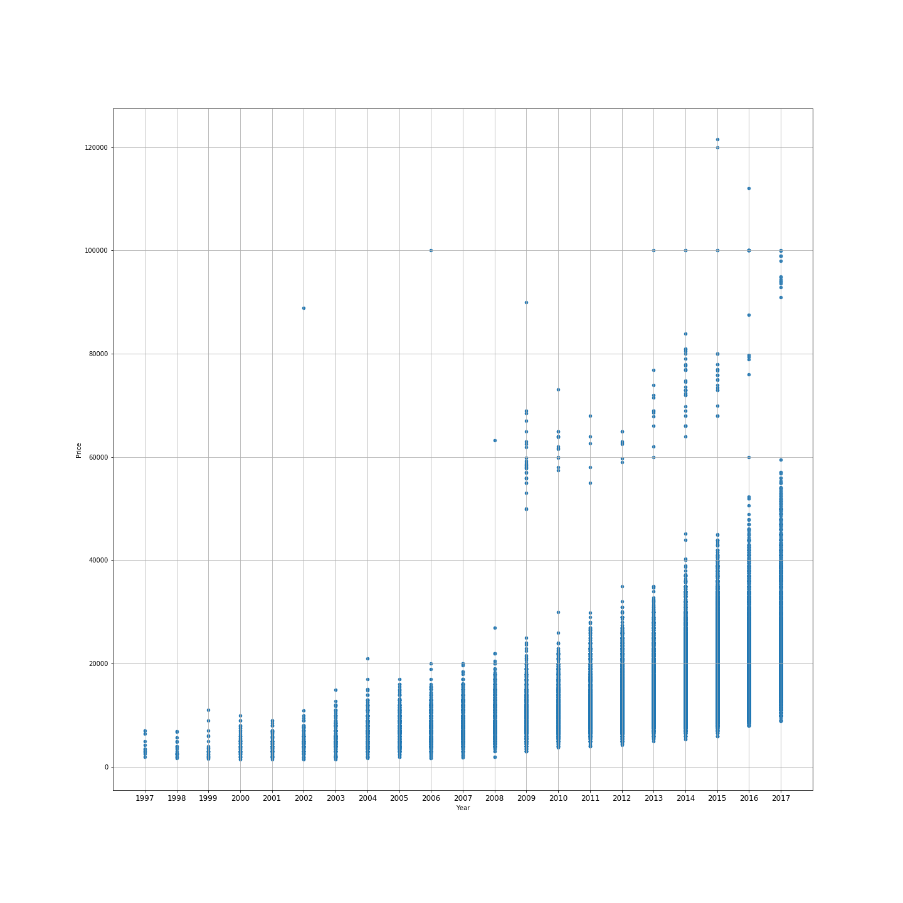

# Model Year and Resale Price
Anna Givens

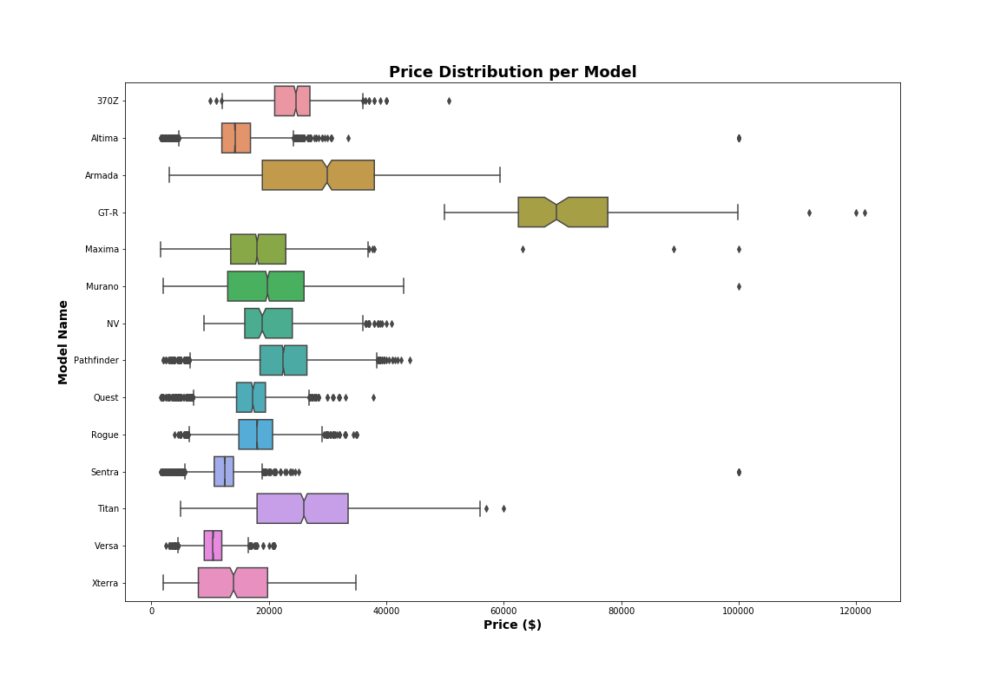

## Findings
- The average price of a used Nissan is $16,602 (USD)
- When sorting by the highest price, there are some listings of non-luxury or sport vehicles (Altima, Sentra) that are priced extremely high and seem inaccurate (99,999).  This may be an attempt by the listing party to appear at the top of the list when sorted by price. 
- GT-Rs have the highest entry price of any used Nissan listing in this dataset. 
- The lower quartile of price(USD) is 1,500 
  - 25% $11,950 
  - 50% $15,000 
  - 75% $19,990 
  - and upper quartile $121,495

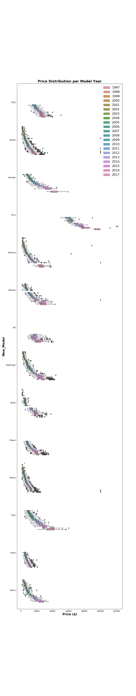

# Residual Value by Model and Model Year
John Patten

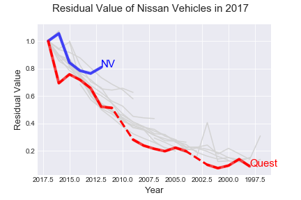

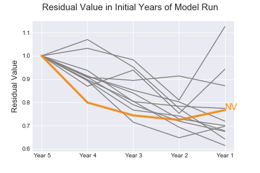

## Findings:

- Residual value is related to the lifespan of the *model*.
- Possible explanation: novelty vs. substitution.
- Best car to buy this year for resale next year?
    - New-ish year of the newest model
    - Older year of an older model

# II. After initial research, collaborate on findings and comprise data to an overall theme
## Educated Recommendation - What used Nissan vehicle do we recommend for our hypothetical customer?

1. Problem:
Shopping for a used vehicle can be difficult. You want to make the best investment, but it's hard to know if you are getting the best price/value or if there are other vehicles listed that best suit your needs.  

2. Goal:
What used Nissan car do we recommend user should buy within their ** qualifiers: 
  Budget: $15,000
  Mileage: 50,000 or under
  Location: Tennessee of listing.
  
Is the asking price for this particular car reasonable given the information provided in the dataset. 
What are other vehicles could we recommend? (Slightly overbudget, higher mileage, outside geographic location.)
